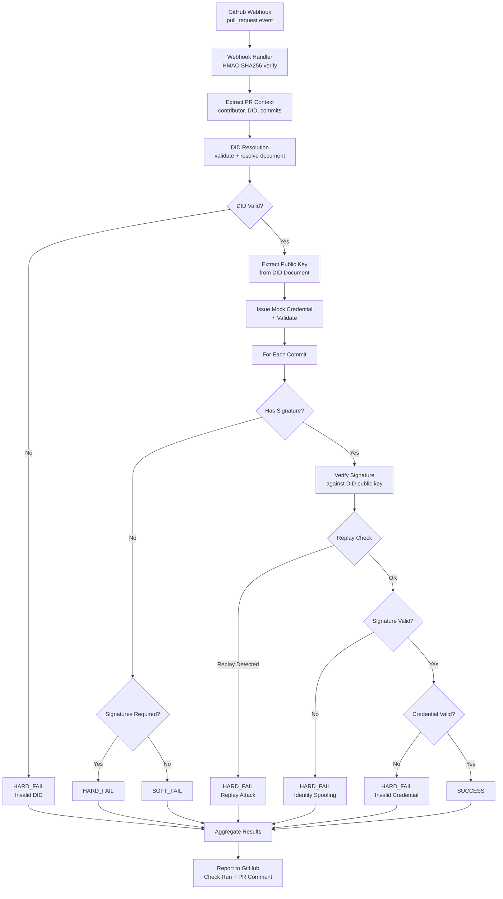
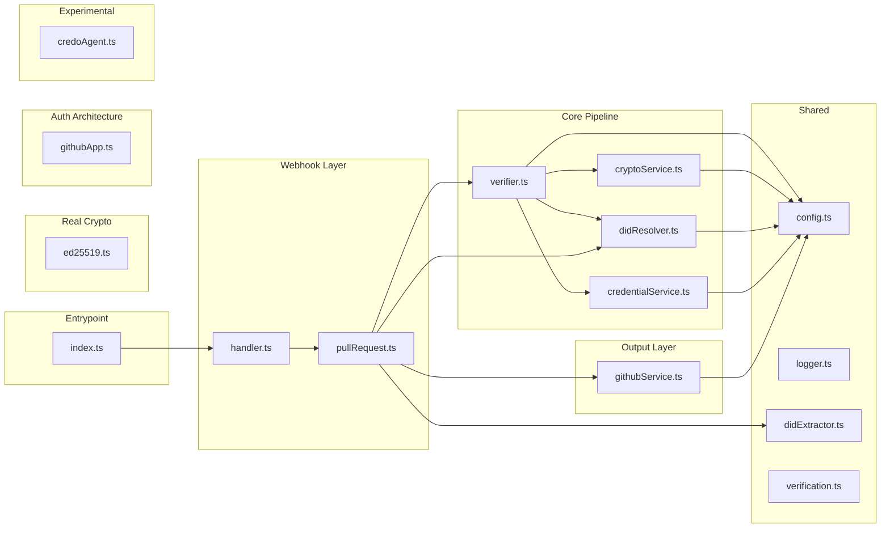

# PR Identity Verifier — Architecture Diagram

## Repository Architecture

```
pr-identity-verifier/
│
├── src/
│   ├── index.ts                          # Server bootstrap (Express + webhook)
│   ├── config.ts                         # Central configuration (env-driven)
│   │
│   ├── auth/
│   │   └── githubApp.ts                  # GitHub App JWT + installation token auth
│   │
│   ├── crypto/
│   │   ├── ed25519.ts                    # Real Ed25519 operations (@noble/ed25519)
│   │   └── types.ts                      # Shared crypto type definitions
│   │
│   ├── services/
│   │   ├── verifier.ts                   # Pipeline orchestrator (core engine)
│   │   ├── cryptoService.ts              # Simulated crypto + replay registry
│   │   ├── didResolver.ts                # DID validation + mock document resolution
│   │   ├── credentialService.ts          # VC issuance + validation (mock)
│   │   └── githubService.ts              # GitHub API (Check Runs, PR comments)
│   │
│   ├── experimental/
│   │   └── credoAgent.ts                 # Credo-ts + Hedera DID architecture
│   │
│   ├── types/
│   │   └── verification.ts              # Pipeline type definitions (W3C aligned)
│   │
│   ├── utils/
│   │   ├── didExtractor.ts              # DID extraction from PR text (regex)
│   │   └── logger.ts                    # Structured logging utility
│   │
│   └── webhook/
│       ├── handler.ts                   # Webhook router (@octokit/webhooks)
│       └── pullRequest.ts               # PR event handler (orchestration glue)
│
├── tests/
│   ├── unit/                            # 86 tests
│   │   ├── credentialService.test.ts    # 13 tests — VC issuance/validation
│   │   ├── cryptoService.test.ts        # 15 tests — crypto + replay protection
│   │   ├── didExtractor.test.ts         # 8 tests — DID extraction from text
│   │   ├── didResolver.test.ts          # 20 tests — DID validation/resolution
│   │   ├── ed25519.test.ts              # 25 tests — real Ed25519 crypto
│   │   └── replayRegistry.test.ts       # 5 tests — replay TTL behavior
│   │
│   ├── integration/                     # 13 tests
│   │   └── pipeline.test.ts             # Full pipeline (DID→sig→cred→result)
│   │
│   ├── adversarial/                     # 10 tests
│   │   └── security.test.ts             # Spoofing, forgery, replay, injection
│   │
│   └── concurrency/                     # 4 tests
│       └── parallel.test.ts             # Rapid commits, parallel PRs
│
├── app.yml                              # GitHub App permission manifest
├── jest.config.js                       # Jest + ts-jest configuration
├── tsconfig.json                        # TypeScript strict mode configuration
├── package.json                         # Dependencies and scripts
└── README.md                            # Project documentation (369 lines)
```

## Verification Pipeline Flow



## Module Dependency Graph



## Component Status Matrix

```
┌─────────────────────┬──────────────────┬─────────────────────────┐
│ Component           │ Status           │ Test Coverage           │
├─────────────────────┼──────────────────┼─────────────────────────┤
│ Ed25519 Crypto      │ ✅ REAL          │ 100% (25 tests)         │
│ Replay Registry     │ ✅ REAL          │ 87% (5+4 tests)         │
│ DID Validation      │ ✅ REAL          │ 94% (20 tests)          │
│ DID Resolution      │ 🔶 MOCK          │ 94% (via DID tests)     │
│ VC Issuance         │ 🔶 MOCK          │ 100% (13 tests)         │
│ VC Validation       │ 🔶 MOCK          │ 100% (13 tests)         │
│ Verification Engine │ ✅ REAL          │ 93% (13+10+4 tests)     │
│ GitHub App Auth     │ ✅ REAL (arch)   │ 0% (requires live App)  │
│ Credo-ts Agent      │ 🔬 EXPERIMENTAL │ 0% (architecture only)  │
│ Webhook Handler     │ ✅ REAL          │ 0% (requires live API)  │
│ GitHub API Service  │ ✅ REAL          │ 0% (requires live API)  │
└─────────────────────┴──────────────────┴─────────────────────────┘
```
